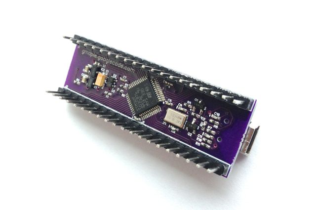
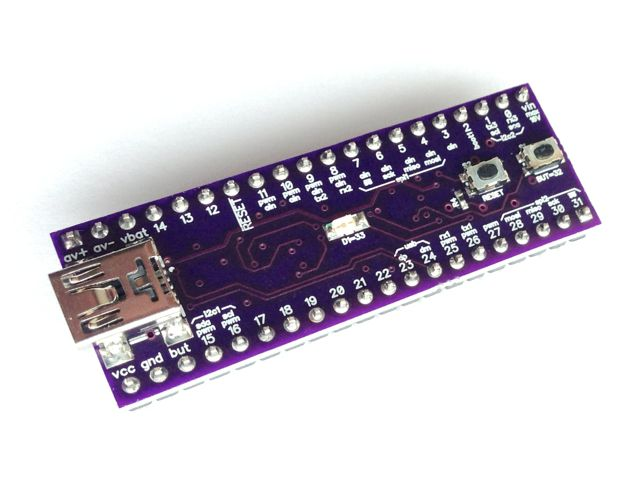
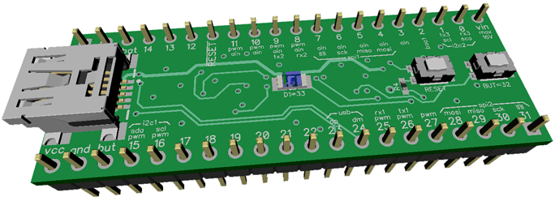
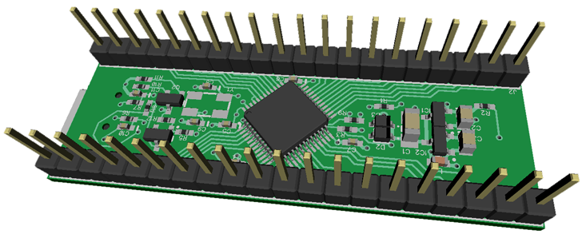
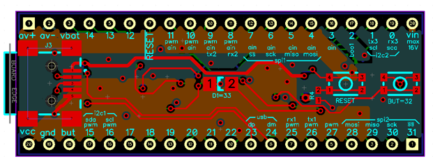

# gMaple-mini
#### Diptrace version by Gruvin

**2014-03-05** LeafLabs appear to have ended production of their Maple and Maple-mini products.

### Original LeafLabs Source
EDIT: 2016-12-04: My work was based on a ZIP download, which I apparently forgot even came from LeafLab's 
[own GitHub repo](https://github.com/leaflabs). You can find all their original work there, at [https://github.com/leaflabs](https://github.com/leaflabs).

### My Diptrace Trial, Maple-mini Exercise
At the time, I was not able to find any suppliers with remaining stock of the Maple-mini. 
I have since found that SparkFun.com still still appear to make the boards and there's a bunch of cheap almost-clones on eBay. Even though the gerbers from LeafLabs are available somewhere, I decided to roll my own, using [Diptrace](http://diptrace.com) (free version) for the first time, as a trial run.

**2014-04-14** The first gMaple-mini is built and tested working. :-)

*[OSH Park](https://oshpark.com/) was by far the cheapest place to get small 4-layer boards like this made. You get 
gold plated as standard, too. Did you know that even their packaging is the same funky purple? Great branding!*

This design is heavily based on the original from LeafLabs, with special care to retain the ground 
and power plains for VCC/GND and AVCC/AGND, on a four-layer board, along with high quality decoupling 
capacitors, push buttons, etc. (There are cheap knock-offs on eBay without any of that, far as I can tell.)

The following are early draft version, [Diptrace](http://diptrace.com) renderings ...

Diptrace uses VRML 2.0 (.wrl) 3D files. The USB socket, LED and push buttons are my own work, done in [Wings3D](www.wings3d.com/).

This is my first 4-layer board, done as much for the learning experience as anything else.

### Diptrace, huh?
A member of the [Particle™](https://particle.io) (formally Spark™) community put me onto it. I really like it.

2016-11-08: Diptrace is available for free, with all features and libraries, maximum 300 pins and 2 signal layers 
(unlimited power planes), for non-profit use only -- no board size limits! It runs under Windows natively and under Linux and macOS, using a bottled wine installation. (I installed the Windows version on my Mac, using my existing wine instance.)

### But everyone uses Eagle! 
Not me. I use KiCAD, mostly. See below. Diptrace [Diptrace](http://diptrace.com) seems a better deal than Eagle also, in that it has no board size limits (only a generous 
pin count) and has a far more user friendly interface, imho. Licensed versions are also considerably cheaper than Eagle.

Eagle would cost me at $700, simply because some of my boards are too big for the free version, meaning 
I cannot use it *at all* in those cases. Example: [gruvin9x](https://github.com/gruvin/gruvin9x). 
No way I can justify that kind of coin.

#### Original LeafLabs Project
For schematics in whatever LeafLabs originally used  (Eagle?) including PDF format, 
please see their [original work](https://github.com/leaflabs/maplemini).

#### Diptrace Schematic PDF
Diptrace, rather annoyingly, doesn't have a Print-to-PDF option (neither does Windows, *still*, in 2016. What the ...!?) or the ability to "plot" a schematic to a Postscript file or whatever. So, the best I can offer in the way of a PDF schematic is [this screenshot](https://github.com/gruvin/gmaple/raw/master/img/Diptrace%20Schematic%20Screen%20Shot%202016-12-04.png).

### KiCAD Still the Best Open Source EDA Suite
[KiCAD](http://kicad-pcb.org/) is still my favourite. I use it for most my stuff. It's fully open source and free (as in speech and as in beer.) When I originally wrote this document, Diptrace has some nice features that were missing from KiCAD. Since then though. CERN has taken up the gauntlet to support continued development of KiCAD and things are looking much better for its future. So, I’m back to using KiCAD for everything.

### Creative Commons share-a-like CC-BY-SA 2.0 License
gMaple-mini is licensed to match the original [LeafLabs](https://github.com/leaflabs] design. 

